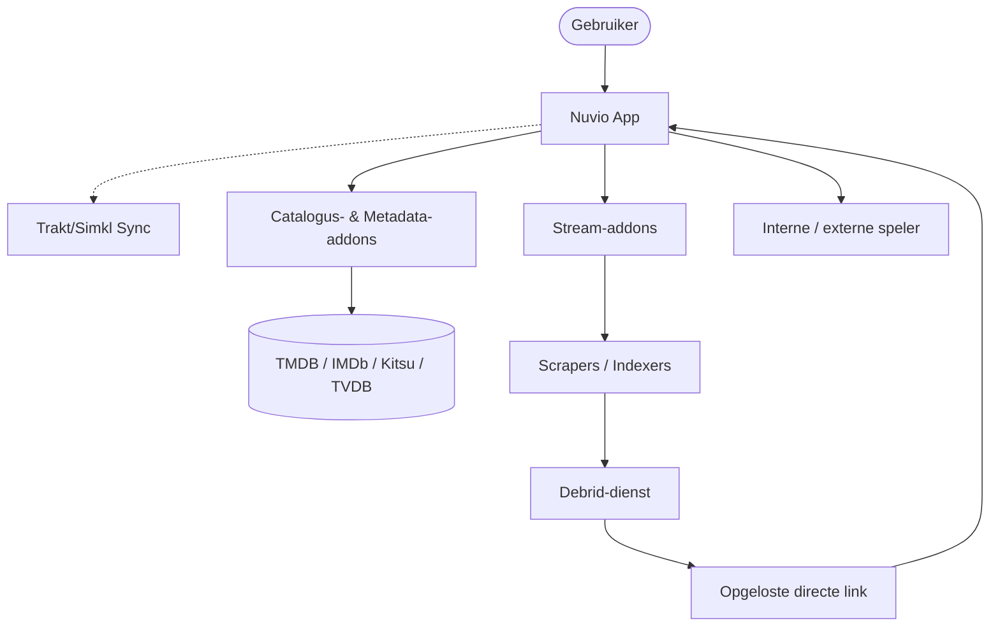

# Algemeen overzicht

Nuvio is een krachtige media-aggregator die is ontworpen om een uniforme interface te bieden voor verschillende inhoudsbronnen. Hiermee kunnen gebruikers media van meerdere aanbieders bekijken en afspelen via een zeer aanpasbare en moderne gebruikersinterface.

> [!TIP]
> Wil je gewoon snel aan de slag? Bekijk dan de [Quick Start Guide](quick-start.md).

## Visuele architectuur

## Hoe het werkt

Nuvio werkt met een modulaire architectuur op basis van **addons**. Zonder addons is Nuvio een speler zonder ingebouwde inhoud.

1.  **De app:** De basis die de gebruikersinterface, speler en beheertools bevat.
2.  **Addons:** Externe modules die aan Nuvio worden gekoppeld om inhoudscatalogi aan te bieden, zoals films, series en anime.
3.  **Indexering:** Nuvio indexeert metadata van je ingeschakelde addons om een doorzoekbare database te maken.

## Belangrijkste functies

- **Cross-platform:** Beschikbaar op Android (Mobiel en TV), iOS en Windows.
- **Gecentraliseerd zoeken:** Zoek tegelijkertijd in alle geïnstalleerde addons.
- **Profielen:** Voeg profielen toe om kijkgeschiedenis en voorkeuren gescheiden te houden.
- **Intro/Outro overslaan:** Maakt gebruik van introDB om intro's en outro's over te slaan.
- **Automatische bronselectie:** Speelt automatisch een bestand af op basis van je instellingen. Geen invoer nodig.
- **Trakt-integratie:** Synchroniseer je kijkgeschiedenis en lijsten.
- **Aanpasbare gebruikersinterface:** Thema's en lay-outopties die bij je apparaat passen.
